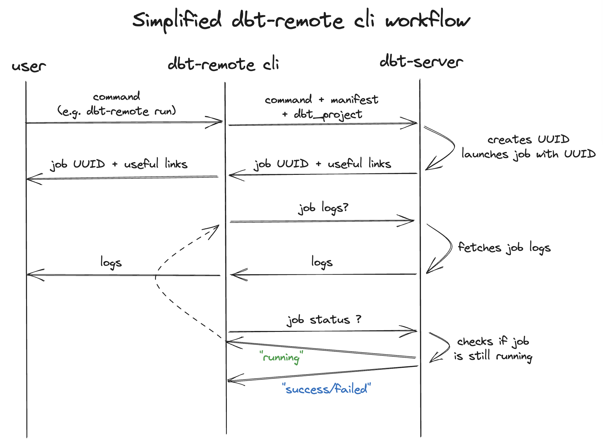
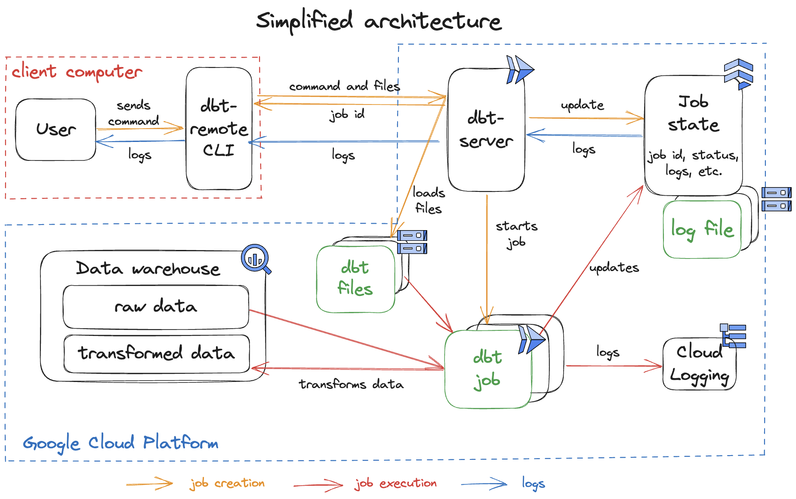
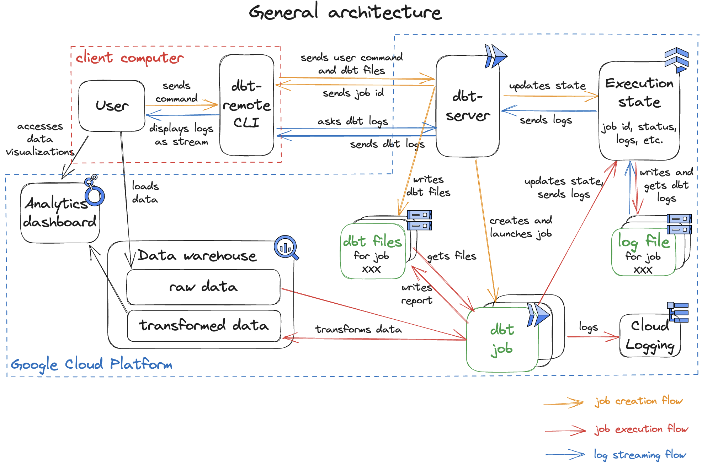

# dbt-remote project

This package aims to run [dbt][dbt-url] commands remotely on GCP using Cloud Run jobs. To this end, you need to set up a ```dbt-server``` on Cloud Run and install the ```dbt-remote``` cli to run your ```dbt``` commands.

- **Run** ```dbt-remote``` cli (for dbt users): [here](#dbt-remote-cli).
- **Deploy** the ```dbt-server``` (for admins): [here](#dbt-server-admin-use).
- Learn how it works (for developers/curious): [here](#how-does-it-work)


# dbt-remote cli

This cli aims to run [dbt][dbt-url] commands remotely on GCP. To function, it requires to host a ```dbt-server``` (which will create the Cloud Run jobs).

- [Requirements](#requirements)
- [Installation](#installation)
- [Usage](#run-dbt-remote-cli)
- [Options](#other-options)
- [Troubleshooting](#troubleshooting)
- [Command example](#dbt-remote-command-examples)
- [How it works](#how-does-dbt-remote-work)

## Requirements

### **dbt-server.**
Before running ```dbt-remote```, make sure you have at least one running ```dbt-server``` on your GCP project Cloud Run. If no ```dbt-server``` is set up yet, see [dbt-server section][dbt-server-section].
> **Important**: if your dbt-server requires authentication, you will need to store credentials locally to allow the cli to connect the server. See [prepare authentication](#prepare-authentication) below.

### **Where to run the cli?**
To run ```dbt-remote```, you should be in a working ```dbt``` project. If not, see [Start a dbt project from scratch](#start-a-dbt-project-from-scratch).

This means:
- ```dbt_project.yml``` should be in your current directory 
- ```manifest.json``` should be in ```target/``` (if you renamed this folder, please see [```--manifest``` option](#manifest-and-dbt_project-files)).
- your dbt project is well configured (especially ```profiles.yml```). To check that, run:
```sh
dbt debug
```

> Note: If you are not directly in the dbt project, you can specify the path to you dbt project using the option ```--project-dir path/to/project```.

> You can also use specific ```manifest.json``` or ```dbt_project.yml``` files (see how [here](#manifest-and-dbt_project-files)).

### **Start a dbt project from scratch**

Install or upgrade dbt:
```sh
pip3 install --upgrade dbt-core dbt-bigquery
```

Initialize a dbt project: (no need to create a dedicated folder, dbt will create one itself)
```sh
dbt init --profiles-dir .
```
Then fill the required options:
- name (ex: dbt_test)
- database (**bigquery**)
- authentication method (```oauth``` will use your credentials (easier), ```service_account``` requires you to create a dedicated service account)
- threads (ex: 3)
- job execution (ex: 300)
- location (ex: EU)

In the newly-created dbt folder, test the project configuration:
```sh
dbt debug
```
> Note: You may need to enable BigQuery API on [Google Cloud interface][bigquery-api] or by running:
```sh
gcloud services enable bigquery.googleapis.com
```

### **Prepare authentication**

If your dbt-server requires authentication, you must pass credentials to ```dbt-remote```.

First, create a service account with ```run.invoker``` permission:

```sh
PROJECT="<PROJECT-ID>";
ACCOUNT="dbt-remote-auth-sa";

EMAIL="${ACCOUNT}@${PROJECT}.iam.gserviceaccount.com";

gcloud iam service-accounts create ${ACCOUNT} \
--project=${PROJECT};

gcloud projects add-iam-policy-binding ${PROJECT} \
  --member=serviceAccount:${EMAIL} \
  --role=roles/run.invoker;

gcloud iam service-accounts keys create key.json --iam-account=${EMAIL}
```

It will create a service account named ```dbt-remote-auth-sa``` with ```run.invoker``` role and generate service account keys, stored locally in ```key.json```. You can put this file wherever you want on your computer.

> :warning: ```key.json``` is a sensible file and must never be published.


## Installation

```sh
python3 -m pip install --extra-index-url https://test.pypi.org/simple/ dbt-remote --no-cache-dir
```

To test the cli installation, run:
```sh 
dbt-remote debug --location <LOCATION>
```
where ```<LOCATION>``` is your dbt-server's location.

If the authentication is enforced, add ```--credentials``` option:
```sh 
dbt-remote debug --location <LOCATION> --credentials <PATH/TO/key.json>
```


## Run dbt-remote cli

```dbt-remote``` cli aims to function almost like ```dbt``` cli. You can run regular ```dbt``` commands such as ```'dbt run'```.
```sh 
dbt-remote run
```
The previous command will use the [automatic server detection](#dbt-server-detection). If you prefer, you can also precise you server url:
```sh 
dbt-remote run --server-url https://<dbt-server-url>
```

## Other options:

You can see all available options using ```dbt-remote --help```.
Below is a quick insight on:
- [dbt-server automatic detection](#dbt-server-detection)
- [authentication](#authentication)
- [--manifest and --dbt-project options](#manifest-and-dbt_project-files)
- [adding dbt packages](#extra-packages)
- [elementary report](#elementary-report)
- [seeds](#seeds-path)
- [profile/target management](#profiletarget-management)
- [configuration](#dbt-remote-configuration)

### **dbt-server automatic detection**

By default, the cli automatically looks for a ```dbt-server``` on your GCP project's Cloud Run. To this end, the cli will fetch information regarding the ```project_id``` and the ```location``` in ```profiles.yml``` if it finds one in the current ```dbt project```.

If the location in ```profiles.yml``` is not the same as the ```dbt-server```'s (typically: location in ```profiles``` is ```US``` while the server runs in ```us-central1```), you need to precise the right location using ```--location```.

Ex: 
```sh
dbt-remote run --select my_model --location europe-west9
```
To save your default location or server url, you can use [dbt config](#dbt-remote-configuration).


### **Authentication**

If the authentication is enforced on your server, add ```--credentials``` option:
```sh 
dbt-remote debug --location <LOCATION> --credentials <PATH/TO/key.json>
```
where ```<PATH/TO/key.json>``` is the path to your service account's credentials. Ex: ```./key.json```.

To save your default credential path, you can use [dbt config](#dbt-remote-configuration) to set ```creds_path```.

### **Manifest and dbt_project files**

To function, the cli sends different files to the ```dbt-server```, including ```manifest.json``` and ```dbt_project.yml```. By default, the cli recompiles the ```manifest.json``` at each execution.

If you do not want the cli to re-compile it, you can use the ```--manifest``` option to indicate a specific ```manifest.json``` file to use.

Similarly, you can specify a ```dbt_project.yml``` file using ```--dbt-project``` option.

Example:
```sh
dbt-remote list --manifest test-files/manifest.json --dbt-project test-files/dbt_project.yml
```

To save your default location or server url, you can use [dbt config](#dbt-remote-configuration).

> Be careful: if you already specified a ```project-dir```, the ```manifest``` and ```dbt_project``` paths should be **relative** to the ```project-dir```.

Example:
```
├── folder1
├── folder2       <-- dbt project folder
   ├── macros
   ├── models
   ├── seeds
   ├── ...
   ├── target
   │   ├── manifest.json
   │   ├── ...
   ├── dbt_project.yml
   ├── ...
```
The command is:
```sh
dbt-remote list --project-dir folder2
```
and if you want to specify the ```manifest``` and ```dbt_project``` files:
```sh
dbt-remote list --project-dir folder2 --manifest target/manifest.json --dbt-project dbt_project.yml
```

### **Extra packages:**

By default, the cli do not send the ```packages.yml``` file and the job running on Cloud Run will not install any additional dependency.

If you need to import specific packages, you can use ```--extra-packages``` to specify the ```packages.yml``` file to send. The Cloud Run Job will run ```dbt deps``` at the beginning of its execution to install the packages.

Ex: 
```sh
dbt-remote run --select my_model --extra-packages packages.yml
```

For example if your project uses ```elementary```, you should add this option.


### **Elementary report**

If you want to produce an [elementary][elementary-url] report at the end of the job execution, you can add the ```--elementary``` flag. You may also need to specify ```--extra-packages``` if elementary is not installed on your Cloud Run job by default.

To systematically create report, you can set elementary to True in the config file using [dbt config](#dbt-remote-configuration).


### **Seeds path**

If you run ```seeds``` command, you can specify the path to seeds directory using ```--seeds-path```. By default: ```./seeds/```

Ex: ```dbt-remote seeds --seeds-path test/seeds```*

To save your default seed path, you can use [dbt config](#dbt-remote-configuration).


### **Profile/target management**

Your ```profiles.yml``` may contain several profiles or targets. In the same way as for regular ```dbt``` commands, you can specify ```--profile``` and ```--target```.

> :warning: For ```--profile``` and ```--target```, the job executing the command will **not take into account your local ```profiles.yml```**: it already has a copy of ```profiles.yml``` in its Docker image. If you modify your ```profiles.yml```, you need to update the Docker image (see [dbt-server README][dbt-server-section]).


### **dbt-remote configuration**

If you want to save your usual ```dbt-remote``` parameters (ex: ```location```, ```server-url```, etc.), you can use the ```config``` command. Using this command, you can set the following parameters:
- manifest
- project_dir
- dbt_project
- extra_packages
- seeds_path
- server_url
- location
- elementary
- creds_path

> To see all ```config``` options, run ```dbt-remote config help```.

**Get started with ```config``` command**

First you need to initialize your config file (it will create a ```dbt_remote.yml``` config file with the default config).
```sh
dbt-remote config init
```
Then you can add your config
```sh
dbt-remote config set server_url=http://myserver.com location=europe-west9
```
Check the config values
```sh
dbt-remote config get server_url location
```
From now on, by default, ```dbt-remote``` will use these value. You can override them at any execution by specifying a new value in your command, ex:
```sh
dbt-remote run my_model                         <-- will use your config values
dbt-remote run my_model --location new_location <-- override the config location value
```


## dbt-remote command examples

- run my_model model with Elementary report: 

```sh
dbt-remote --log-level info run --manifest project/manifest.json --select my_model --dbt_project project/dbt_project.yml --extra-packages project/packages.yml --elementary
```


- list with specific profile and target: 

```sh
dbt-remote --log-level debug list --project-dir test/ --profile my_profile --target dev
```


- build with local server url: 

```sh
dbt-remote build --server-url http://0.0.0.0:8001
```

## Troubleshooting

### Location issue

**Error message**

```Permission denied on location `EU` for project <PROJECT>. Please check the server location and specify the correct --location argument.```

**Why?**

This issue occurs when ```dbt-remote``` tries to list your Cloud Run services during the automatic server detection.

**Troubleshoot**

- If you didn't specify any ```--location```, therefore ```dbt-remote``` will deduce the location from your ```profiles.yml```. Usually, the ```profiles``` locations are multi region (EU, US) but Cloud Run services can only run on region (europe-west9, us-central1), so your location does not exist for Cloud Run. --> To fix: set ```--location <your-dbt-server-location>```.

- If you specified a multi region location (```--location EU``` or ```--location US```), see point above.

- If you specified a region location, check that you (or your service account depending on your authentication method) have the permission ```roles/run.developer```.

### Other issue

Please contact me (emma.galliere@artefact.com)

## How does dbt-remote work ?

A simplified version of dbt-remote cli interactions with the dbt-server is presented on [this image](./dbt-remote-cli-workflow-simplified.png).

<center></center>


# dbt-server (admin use)

This section is dedicated to ```dbt-server``` deployment and maintenance by system administrators.

```dbt-server``` is a Fastapi server allowing users to run ```dbt``` commands on Cloud Run jobs and to follow their execution in real-time. When the server receives a dbt command request, it creates and launches a job to execute it. The complete workflow is described in the [Architecture schema](./dbt-remote-schema.png).

<center></center>

- [Requirements](#requirement-submit-docker-image)
- [Deployment](#deployment-on-gcp)
- [Local run](#local-run--for-contributors)
- Requests example (TO DO)

## Requirement (Submit Docker image)

To deploy this server on GCP, you need to first build and deploy the ```Dockerfile``` on your Artifact registry on GCP. To this end, follow these steps:

### 1. Clone repository
Clone this repository and go to the ```dbt-server``` folder.
```sh
git clone git@github.com:artefactory-fr/dbt-server.git
cd dbt-server
```

### 2. Profiles.yml content
Check that ```profiles.yml``` contains the right information regarding your dbt project (```dataset```, ```project```, ```location```). You can also replace this file by your dbt project's ```profiles.yml```.

### 3. Artifact registry creation

If you do not have any artifact registry on GCP yet, [create one][create-artifact-registry]. One way to do this is to use [gcloud cli][gcloud]:
```sh
gcloud artifacts repositories create <REPOSITORY> --repository-format=docker --location=<LOCATION> --description="<DESCRIPTION>"
```
with ```REPOSITORY``` your repository name, ```LOCATION``` the location you want and ```DESCRIPTION``` its description.

Ex:
```sh
gcloud artifacts repositories create dbt-server-repository --repository-format=docker --location=europe-west9 --description="The repository dedicated to dbt-server Docker images."
```

### 4. Build/deploy the Docker image

Build and deploy the ```Dockerfile ``` to the registry. Using [gcloud cli][gcloud]:
```sh
gcloud builds submit --region=<LOCATION> --tag <LOCATION>-docker.pkg.dev/<PROJECT-ID>/<REPOSITORY>/<IMAGE>
```
where:
- ```<LOCATION>``` should be your Artifact Registry's location
- ```<PROJECT-ID>``` is your GCP Project ID
- ```<REPOSITORY>``` is the name of your artifact registry
- ```<IMAGE>``` is the name you want to give to your Docker image

Ex:
```sh
gcloud builds submit --region=europe-west9 --tag europe-west9-docker.pkg.dev/my-project-id/dbt-server-repository/dbt-server
```


## Deployment on GCP

> :warning: **Recommendation**
The dbt-server deployment is easier and quicker using [Terraform][terraform]. We highly recommend to use the following module [dbt-server-terraform-module-repo].

### Resources creation

To run your dbt-server, you need to create the following resources.

- a bucket on Cloud Storage
```sh
gcloud storage buckets create gs://<BUCKET_NAME> --project=<PROJECT_ID> --location=<LOCATION>
```

- a service account with the necessary permissions. Change the value of ```<PROJECT-ID>``` then execute the following code in your terminal:
```sh
PROJECT="<PROJECT-ID>";
ACCOUNT="dbt-server-sa";

EMAIL="${ACCOUNT}@${PROJECT}.iam.gserviceaccount.com";

ROLES=(
  "datastore.user"
  "storage.admin"
  "bigquery.dataEditor"
  "bigquery.jobUser"
  "bigquery.dataViewer"
  "bigquery.metadataViewer"
  "run.developer"
  "iam.serviceAccountUser"
  "logging.logWriter"
  "logging.viewer"
);

gcloud iam service-accounts create ${ACCOUNT} \
--project=${PROJECT};

for ROLE in ${ROLES[@]}
do
  echo $ROLE;
  gcloud projects add-iam-policy-binding ${PROJECT} \
  --member=serviceAccount:${EMAIL} \
  --role=roles/${ROLE};
done
```

You also need to enable the following APIs:

- Firestore API
```sh
gcloud services enable firestore.googleapis.com
```
- Cloud Run API
```sh
gcloud services enable run.googleapis.com
```


### dbt-server deployment

To deploy your dbt-server, complete the following code with the resources you created and run it:
```sh
gcloud run deploy <SERVER-NAME> \
	--image <IMAGE> \
	--platform managed \
	--region <LOCATION> \
	--service-account=<SERVICE-ACCOUNT> \
	--set-env-vars=BUCKET_NAME=<BUCKET-NAME> \
	--set-env-vars=DOCKER_IMAGE=<IMAGE> \
	--set-env-vars=SERVICE_ACCOUNT=<SERVICE-ACCOUNT> \
	--set-env-vars=PROJECT_ID=<PROJECT-ID> \
	--set-env-vars=LOCATION=<LOCATION>
```

Ex:
```sh
gcloud run deploy dbt-server-test \
	--image europe-west9-docker.pkg.dev/my-project-id/test-repository/server-image \
	--platform managed \
	--region europe-west9 \
	--service-account=dbt-server-sa@my-project-id.iam.gserviceaccount.com \
	--set-env-vars=BUCKET_NAME='dbt-server-bucket' \
	--set-env-vars=DOCKER_IMAGE='europe-west9-docker.pkg.dev/my-project-id/test-repository/server-image' \
	--set-env-vars=SERVICE_ACCOUNT='dbt-server-sa@my-project-id.iam.gserviceaccount.com' \
	--set-env-vars=PROJECT_ID='my-project-id' \
	--set-env-vars=LOCATION='europe-west9'
```
When asked "Allow unauthenticated invocations to [dbt-server-test] (y/N)?", type "y".


### Verify the deployment

To check that your server is properly deployed, you can run
```sh
curl https://<your-server>/check
```
You should receive a response similar to: ```{"response":"Running dbt-server on port 8080"}```.


## Local run / For contributors

You can also run the server locally using ```dbt_server.py```.

**Be careful, this configuration still connects to GCP and expects a environement configuration as well as some cloud resources** (e.g. a Cloud Storage bucket). This means **you must create different GCP resources beforehand**. To this end, we recommend running the ```Terraform``` module or the manual resource creation (see [section above](#deployment-on-gcp)).

Make sure you have sufficient permissions (```roles/datastore.owner```, ```roles/logging.logWriter```, ```roles/logging.viewer```, ```roles/storage.admin```, ```roles/run.developer```, ```roles/iam.serviceAccountUser```) and declare your configuration in your terminal:
```sh
export BUCKET_NAME=<bucket-name>
export DOCKER_IMAGE=<docker-image>
export SERVICE_ACCOUNT=<service-account-email>
export PROJECT_ID=<project-id>
export LOCATION=<location>
```
**Info**: If you used Terraform to create the resources, ```<service-account-email>``` should be ```terraform-job-sa@<project-id>.iam.gserviceaccount.com``` and ```<bucket-name>``` ```dbt-server-test```.

Install the dependencies:
```sh
pip install -r requirements.txt
```
Then launch the ```dbt-server```:
```sh
python3 dbt_server/dbt_server.py --local
```

Your dbt-server should run on ```http://0.0.0.0:8001```.


## Send requests to dbt-server

TO DO


# How does it work

The global project architecture is summed up as follow.

<center></center>

The main components are:
- the [dbt-remote cli](#dbt-remote-cli): it handles user command and interacts with the server (by sending the dbt command and streaming the logs). More precisely, it receives the user commands, makes the required transformations, loads the required files (manifest.json, dbt_project.yml, and possibly packages.yml and seeds files), crafts a HTTP request and sends it to the dbt-server (waiting for the server response). Once the server replies with job UUID and links to follow its execution, the cli will send requests to the server every second to follow up the job status and logs.
- the [dbt-server](#dbt-server) (Fastapi server on Cloud Run service): it handles dbt command requests by creating and launching Cloud Run jobs. It also allow the cli to steram logs by requesting the State
- the State: it is an object used by both the dbt-server and the dbt-job to store the job state. It interacts with Firestore and Google Cloud Storage and stores information such as: the uuid, the run status (running/succes/failed...), the user command, the job logs (stored on GCS).
- the dbt-job (Python script running on a Cloud Run Job): it first loads the context files (manifest.json, dbt_project.yml and others) then executes the dbt command. During the execution, it logs both on Cloud Logging and using the State. This allow the cli to follow the execution in near real-time.

These operations can be divided in 3 main flows:
- the [job creation flow](#job-creation)
- the [job execution flow](#job-execution)
- the [log streaming flow](#log-streaming)

## Job creation

cli
- detects the dbt-server
- it transforms the user command
- it fetches the required files
- it sends to the server

server
- receives the request
- generate uuid
- initialize a state using the uuid (+ loads files)
- creates and launches a Cloud Run Job


## Job execution

job
- loads files
- (possibly) install deps
- executes dbt command (interaction with BQ)
- logs to Cloud Logging + State
- (possibly) generate report
- sends 'END JOB' log

## Log streaming

cli
- requests job run status
- while not received 'END JOB' or run status = 'failed', request logs

server
- receives logs requests
- request logs to State

State
- receives logs requests
- look at 'log_starting_byte' var
- fetch logs files from this byte
- sends to server

server
- sends to cli

cli
- display logs


[//]: #

   [dbt-url]: <https://www.getdbt.com/>
   [elementary-url]: <https://www.elementary-data.com/>
   [terraform]: <https://www.terraform.io/>

   [gcloud]: <https://cloud.google.com/sdk/docs/install>
   [create-artifact-registry]: <https://cloud.google.com/artifact-registry/docs/repositories/create-repos>
   [bigquery-api]: <https://console.cloud.google.com/marketplace/product/google/bigquery.googleapis.com>
   

   [dbt-server-repo-url]: <https://github.com/artefactory-fr/dbt-server>
   [dbt-server-section]: #dbt-server-admin-use
   
   [dbt-server-terraform-module-repo]: <https://github.com/artefactory-fr/terraform-gcp-dbt-server/tree/add-dbt-server-terraform-code>
   
