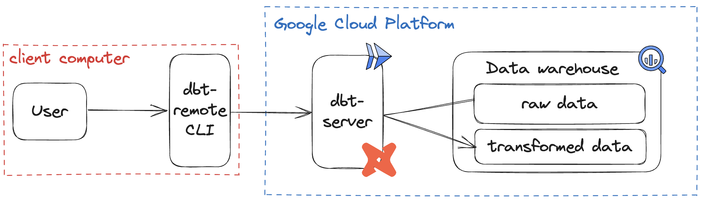

# dbt-remote project

This package provides 
- `dbt-remote`, a drop-in replacement for the dbt CLI. 
- `dbt-server`, a Cloud Run API that will need to be deployed to perform the remote dbt runs.

<center></center>


# dbt-remote

This CLI runs dbt commands remotely on a GCP. 

## Requirements

- [A deployed dbt-server](#dbt-server)
- [An initialized dbt project](https://docs.getdbt.com/quickstarts/) > "Quickstart for dbt Core from a manual install" (end of page)

## Installation

```sh
python3 -m pip install --extra-index-url https://test.pypi.org/simple/ gcp-dbt-remote --no-cache-dir
```

Make sure your dbt project is setup properly locally.
```sh
dbt debug --profiles-dir .
```

Test the CLI installation (requires you to have deployed the `dbt-server`)
```sh 
dbt-remote debug
```

Use `dbt-remote` just like you would the regular dbt CLI
```sh 
dbt-remote run
```

```sh 
dbt-remote run --select my_first_dbt_model
```

View all `dbt-remote` options
```sh
dbt-remote --help
```

Set persistant configurations for `dbt-remote` using `config` command
```sh
dbt-remote config init
dbt-remote config set server_url=http://myserver.com location=europe-west9
```

View all configuration options
```sh
dbt-remote config help
```

----
# dbt-server

This section is dedicated to ```dbt-server``` deployment and maintenance by system administrators.

```dbt-server``` is a Fastapi server allowing users to run ```dbt``` commands on Cloud Run jobs and to follow their execution in real-time. When the server receives a dbt command request, it creates and launches a job to execute it. The complete workflow is described in the [Architecture schema](./dbt-remote-schema.png).

<center></center>


## Deployment

Clone this repository and go to the ```dbt-server``` folder.
```sh
git clone git@github.com:artefactory-fr/dbt-server.git
cd dbt-server
```

Copy the values from the `profiles.yml` in the project you will run `dbt-remote` from to `dbt_server/profiles.yml`.

```sh
export PROJECT_ID=<your-project-id> &&
export LOCATION=europe-west1
```

Create an artifact registry
```sh
gcloud artifacts repositories create dbt-server --repository-format=docker --location=$LOCATION --description="Used to host the dbt-server docker image. https://github.com/artefactory-fr/dbt-server"
```

Create a bucket for artifacts
```sh
gcloud storage buckets create gs://$PROJECT_ID-dbt-server --project=$PROJECT_ID --location=$LOCATION
```

Create a service account that will be used for dbt runs
```sh
gcloud iam service-accounts create dbt-server --project=${PROJECT};
```

Assign roles to the SA
```sh
ROLES=(
  "datastore.user"
  "storage.admin"
  "bigquery.dataEditor"
  "bigquery.jobUser"
  "bigquery.dataViewer"
  "bigquery.metadataViewer"
  "run.developer"
  "iam.serviceAccountUser"
  "logging.logWriter"
  "logging.viewer"
);

for ROLE in ${ROLES[@]}
do
  gcloud projects add-iam-policy-binding ${PROJECT} \
  --member=serviceAccount:dbt-server@${PROJECT}.iam.gserviceaccount.com \
  --role=roles/${ROLE};
done
```

Enable GCP APIs
```sh
gcloud services enable \
    firestore.googleapis.com \
    run.googleapis.com \
    --project=$PROJECT_ID
```

Create Firestore database (default) if not exist
```sh
database=$(gcloud firestore databases list | grep "projects/${PROJECT_ID}/databases/(default)")
if [ -z "$database" ]
then
   echo "(default) database does not exist, creating one...";
   gcloud firestore databases create --location=nam5;
   echo "Created";
else
   echo "(default) database already exists";
fi
```


Build the server image
```sh
gcloud builds submit --region=$LOCATION --tag $LOCATION-docker.pkg.dev/$PROJECT_ID/dbt-server/dbt-server
```

Deploy the server on Cloud Run
```sh
gcloud run deploy dbt-server \
	--image ${LOCATION}-docker.pkg.dev/${PROJECT_ID}/dbt-server/dbt-server \
	--platform managed \
	--region ${LOCATION} \
	--service-account=dbt-server@${PROJECT_ID}.iam.gserviceaccount.com \
	--set-env-vars=BUCKET_NAME=${PROJECT_ID}-dbt-server \
	--set-env-vars=DOCKER_IMAGE=${LOCATION}-docker.pkg.dev/${PROJECT_ID}/dbt-server/dbt-server \
	--set-env-vars=SERVICE_ACCOUNT=dbt-server@${PROJECT_ID}.iam.gserviceaccount.com \
	--set-env-vars=PROJECT_ID=${PROJECT_ID} \
	--set-env-vars=LOCATION=${LOCATION}
  --no-allow-unauthenticated
```

You should now be able to run the `dbt-remote` CLI to execute dbt commands on your server
```sh
dbt-remote debug
```