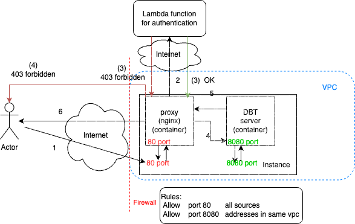

# DBT server on AWS

## Deploying the infrastructure

### Prerequisites

- Install Node.js 14.15.0 or later then run 
```
npm install -g aws-cdk
```
Verify installation
```
cdk --version
```
The CDK CLI will use your security credentials to authenticate with AWS, to configure them you need to run the following:
```
aws configure
```
and then enter you access key ID and secret.
After this your credentials will be saved in `~/.aws/credentials` and your configuration in `~/.aws/config`.

#### Sources
https://docs.aws.amazon.com/cdk/v2/guide/prerequisites.html

https://docs.aws.amazon.com/cdk/v2/guide/getting_started.html

https://docs.aws.amazon.com/cli/latest/userguide/cli-chap-authentication.html

https://docs.aws.amazon.com/cdk/api/v2/python/modules.html

https://docs.aws.amazon.com/cdk/api/v2/python/aws_cdk.html

### Deployment

The `cdk.json` file tells the CDK Toolkit how to execute your app.
At this point you can now synthesize the CloudFormation template for this code:
```
cdk synth
```
Deploy using:
```
cdk bootstrap --profile <profile to use in ~/.aws/credentials>
cdk deploy --profile <profile to use in ~/.aws/credentials>
```
To update the stack just rerun the above commands after modifying the code.

#### Sources
https://docs.aws.amazon.com/cdk/v2/guide/work-with-cdk-python.html

### Useful commands

 * `cdk ls`          list all stacks in the app
 * `cdk synth`       emits the synthesized CloudFormation template
 * `cdk deploy`      deploy this stack to your default AWS account/region
 * `cdk diff`        compare deployed stack with current state
 * `cdk docs`        open CDK documentation


## Architecture
We use mainly three components:
- DBT server: deployed as a container in an instance
- Nginx reverse proxy: deployed as a container in the same instance as the DBT server
- Lambda function: used for authenticating users
<center></center>
As the above image suggests, any request coming from the outside needs to go through the reverse proxy which only forwards requests to the server if the lambda function succeeds at authenticating the request. The firewall is setup to only allow traffic from outside from port 80 which corresponds to the nginx service while the dbt server is on port 8080 and the firewall only accepts traffic to this port from clients with addresses in the same VPC as the instance containing nginx and dbt services.


## Authentication 
AWS Lambda functions can be configured to use IAM authentication. For a user to be able to invoke a lambda function the user needs to have valid credentials and have the permission to invoke the function. We use this functionality to offload handling requests' authentication to a lambda function with IAM authentication type.
IAM authentication authenticates clients by validating the signature in the client's request. This request signing is already integrated in SDK clients, which authenticate using your provided access key ID and secret. AWS provides libraries that generate signed requests using your credentials, you can find an example in `auth/main.py`.

### Sources
https://docs.aws.amazon.com/lambda/latest/dg/urls-auth.html#urls-auth-iam

https://github.com/aws-samples/sigv4-signing-examples/tree/main

https://docs.aws.amazon.com/AmazonS3/latest/API/sig-v4-authenticating-requests.html

https://docs.aws.amazon.com/AmazonS3/latest/API/sigv4-auth-using-authorization-header.html

https://docs.aws.amazon.com/IAM/latest/UserGuide/reference_sigv.html


## Technologie choice

### Serveless deployment solutions

#### App Runner:
Service that provides easy deployment either from source code or a container image. Although this solution is much simpler to setup, it has two major drawbacks that made it a no go, these limitations are:
- Storage is limited to 3GB
- Not possible to mount a volume

##### Sources
https://docs.aws.amazon.com/apprunner/latest/dg/develop.html

#### ECS with Fargate
We use ECS a fully managed container orchestration service with Fargate a serverless compute engine to deploy our dbt server container image. Fargate comes with 21 GB storage by default which can be extended and we can also mount a volume to our container.

##### Sources
https://docs.aws.amazon.com/ecs/
https://docs.aws.amazon.com/AmazonECS/latest/developerguide/AWS_Fargate.html


### Authentication solutions

#### Amazon Cognito
At first we tried Cognito for handling authentication, which required seting up a load balancer with SSL support, an Amazon developer account must also be created. This solution uses a user pool in which users should be added manually, another method is federated identies with amazon as a provider which requires using the aws account's email and password to authenticate. The major drawback with this solution is the fact that the authentication is that it must be done with a through.
Another method is `InitiateAuth` however it can not be used with federated identities. 
Another possibilities is to use a `client_id` and a `client_secret` to authenticate, but this is method is only recommended for server to server authentication.

##### Sources
https://docs.aws.amazon.com/cognito/latest/developerguide/what-is-amazon-cognito.html

https://docs.aws.amazon.com/cognito/latest/developerguide/cognito-identity.html

https://stackoverflow.com/questions/62572327/how-to-pass-cookies-when-calling-authentication-enabled-aws-application-loadbala

https://docs.aws.amazon.com/elasticloadbalancing/latest/application/listener-authenticate-users.html#authentication-flow

https://docs.aws.amazon.com/cognito/latest/developerguide/userinfo-endpoint.html

https://docs.aws.amazon.com/cognito/latest/developerguide/token-endpoint.html

https://docs.aws.amazon.com/cognito-user-identity-pools/latest/APIReference/API_InitiateAuth.html

https://docs.aws.amazon.com/cognito/latest/developerguide/token-endpoint.html

https://docs.aws.amazon.com/cognito/latest/developerguide/cognito-user-pools-assign-domain.html

https://docs.aws.amazon.com/cognito/latest/developerguide/authorization-endpoint.html

https://docs.aws.amazon.com/cognito/latest/developerguide/cognito-integrate-apps.html#amazon-cognito-authentication-with-sdks

https://docs.aws.amazon.com/cognito/latest/developerguide/cognito-user-pools-identity-federation.html

https://docs.aws.amazon.com/cognito/latest/developerguide/amazon-cognito-user-pools-using-the-access-token.html

https://docs.aws.amazon.com/cognito/latest/developerguide/amazon-cognito-user-pools-authentication-flow.html

https://docs.aws.amazon.com/cognito-user-identity-pools/latest/APIReference/API_AdminInitiateAuth.html


#### IAM authentication

There some services that support IAM type of authentication by default, such as:
##### API Gateway

Fully managed service for creating APIs. This API is used as the "front door" to our dbt server. We tested with a REST API Gateway, in order for this API to communicate with our dbt server we had to use a Network load balancer and a VPC link.
At the end, we did not go with this solution because it has a very small maximum integration timeout (timeout between the API and the dbt server) of 60 seconds (default is 29 but can be increased up to 60), and we need a timeout of 30 minutes.

###### Sources
https://docs.aws.amazon.com/apigateway/latest/developerguide/getting-started-with-private-integration.html

https://docs.aws.amazon.com/apigateway/latest/developerguide/set-up-nlb-for-vpclink-using-console.html

https://docs.aws.amazon.com/apigateway/latest/developerguide/api-gateway-create-api-step-by-step.html

https://docs.aws.amazon.com/apigateway/latest/developerguide/http-api-develop-routes.html

https://aws.amazon.com/about-aws/whats-new/2024/06/amazon-api-gateway-integration-timeout-limit-29-seconds/

https://docs.aws.amazon.com/apigateway/latest/developerguide/limits.html#api-gateway-execution-service-limits-table

https://docs.aws.amazon.com/apigateway/latest/developerguide/permissions.html

##### Lambda functions

The first solution we tested using lambda functions, was to use a Lambda function that gets triggered when we hit our server. In order to do this we had to use a load balancer (which forward traffic to our server) since we can not directly trigger the function from our service. The drawback we found with this solution is that when the lambda function is invoked from the load balancer, as opposed to invoking it directly, the function skips the authentication step.

###### Sources
https://docs.aws.amazon.com/lambda/latest/dg/lambda-invocation.html
