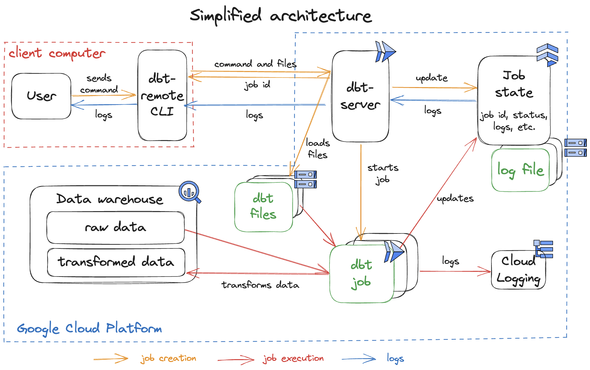
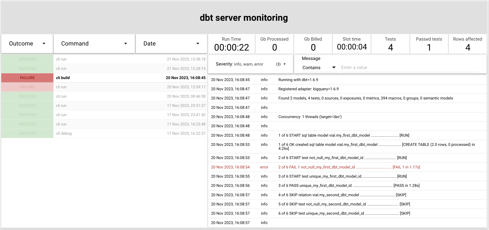

# dbt-server (for data platform engineers)

This section is dedicated to ```dbt-server``` deployment and maintenance by system administrators.

```dbt-server``` is a Fastapi server allowing users to run ```dbt``` commands on Cloud Run jobs and to follow their execution in real-time. When the server receives a dbt command request, it creates and launches a job to execute it. The complete workflow is described in the [Architecture schema](../docs/images/dbt-remote-schema.png).

<center></center>


## Requirements

- A GCP project.
- The following roles:
  - `roles/datastore.owner`
  - `roles/logging.logWriter`
  - `roles/logging.viewer`
  - `roles/storage.admin`
  - `roles/run.developer`
  - `roles/iam.serviceAccountUser`
  - `roles/cloudscheduler.admin`
- The gcloud CLI. [(gcloud install guide)](https://cloud.google.com/sdk/docs/install)


## Deployment

### Export your env variables.
```sh
export PROJECT_ID=<your-project-id> &&
export LOCATION=<dbt-server-region>  # example: europe-west1
```
> For the complete list of regions, run `gcloud compute regions list`

### Setup your GCP project, gcloud CLI, and default credentials
```sh
gcloud auth login
gcloud auth application-default login
gcloud config set project $PROJECT_ID
```

Enable GCP APIs
```sh
gcloud services enable \
    artifactregistry.googleapis.com \
    cloudbuild.googleapis.com \
    firestore.googleapis.com \
    run.googleapis.com \
    bigquery.googleapis.com \
    --project=$PROJECT_ID
```

Create an artifact registry
```sh
gcloud artifacts repositories create dbt-server-repository --repository-format=docker --location=$LOCATION --description="Used to host the dbt-server docker image. https://github.com/artefactory-fr/dbt-server"
```

Create a bucket for artifacts
```sh
gcloud storage buckets create gs://$PROJECT_ID-dbt-server --project=$PROJECT_ID --location=$LOCATION
```

Create a service account that will be used for dbt runs
```sh
gcloud iam service-accounts create dbt-server-service-account --project=${PROJECT_ID}
```

Assign roles to the SA
```sh
ROLES=(
  "datastore.user"
  "storage.admin"
  "bigquery.dataEditor"
  "bigquery.jobUser"
  "bigquery.dataViewer"
  "bigquery.metadataViewer"
  "run.developer"
  "iam.serviceAccountUser"
  "logging.logWriter"
  "logging.viewer"
  "cloudscheduler.admin"
);

for ROLE in ${ROLES[@]}
do
  gcloud projects add-iam-policy-binding ${PROJECT_ID} \
  --member=serviceAccount:dbt-server-service-account@${PROJECT_ID}.iam.gserviceaccount.com \
  --condition=None \
  --role=roles/${ROLE};
done
```

Create a Firestore database (available locations: https://cloud.google.com/firestore/docs/locations#location-mr)
```sh
gcloud firestore databases create --location=eur3
```

Install `dbt-remote` CLI
```sh
python3 -m pip install --extra-index-url https://test.pypi.org/simple/ gcp-dbt-remote --no-cache-dir
```

Refresh your shell/venv:
```sh
source venv/bin/activate
```
OR
```sh
conda activate
```

Build the server image
```sh
dbt-remote image submit --artifact-registry $LOCATION-docker.pkg.dev/$PROJECT_ID/dbt-server-repository
```

Deploy the server on Cloud Run
```sh
gcloud run deploy dbt-server \
	--image ${LOCATION}-docker.pkg.dev/${PROJECT_ID}/dbt-server-repository/server-image \
	--platform managed \
	--region ${LOCATION} \
	--service-account=dbt-server-service-account@${PROJECT_ID}.iam.gserviceaccount.com \
	--set-env-vars=BUCKET_NAME=${PROJECT_ID}-dbt-server \
	--set-env-vars=DOCKER_IMAGE=${LOCATION}-docker.pkg.dev/${PROJECT_ID}/dbt-server-repository/server-image \
	--set-env-vars=SERVICE_ACCOUNT=dbt-server-service-account@${PROJECT_ID}.iam.gserviceaccount.com \
	--set-env-vars=PROJECT_ID=${PROJECT_ID} \
	--set-env-vars=LOCATION=${LOCATION} \
  --no-allow-unauthenticated
```

The deployment of your dbt-server is finished!

To test it, you run [the `dbt-remote` CLI](../README.md) **in a dbt project** to execute dbt commands on your server, such as
```sh
dbt-remote debug
```

## Server Monitoring Dashboard

If you want to, you can deploy a monitoring dashboard with a few extra steps.


Upgrade the `_Default` logs buckets to support log analytics:
```shell
gcloud logging buckets update _Default --location=global --enable-analytics --project=$PROJECT_ID
```

Create a dataset that will allow you to query logs through BigQuery:
```shell
gcloud logging links create log_analytics --bucket=_Default --location=global --project=$PROJECT_ID
```

Now, go to the [dashboard template](https://lookerstudio.google.com/reporting/033e6946-145f-4c6d-b38c-cd7854557ec4) and create a copy:


In the data source, modify the custom query to point to the right billing project and table:


Once this setup is done, your dashboard will display the last 30 days of dbt logs from your server. No other setup is required, the dash directly queries the logs, so the data will always be fresh.

Next steps:
- Brand the dashboard for your client
- Modify the SQL query and dashboard to display charts that make sense in your context

References:
- [Configure log buckets](https://cloud.google.com/logging/docs/buckets)
- [Loggging - Build queries using SQL](https://cloud.google.com/logging/docs/analyze/query-and-view)
