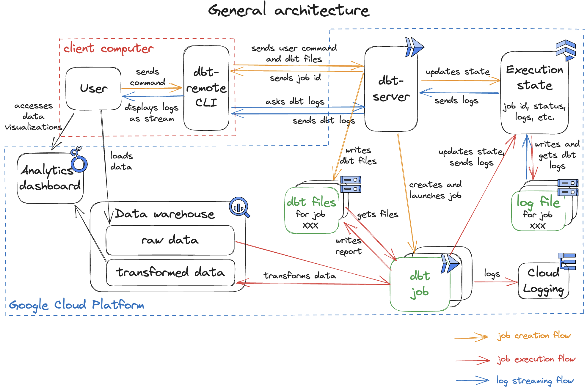
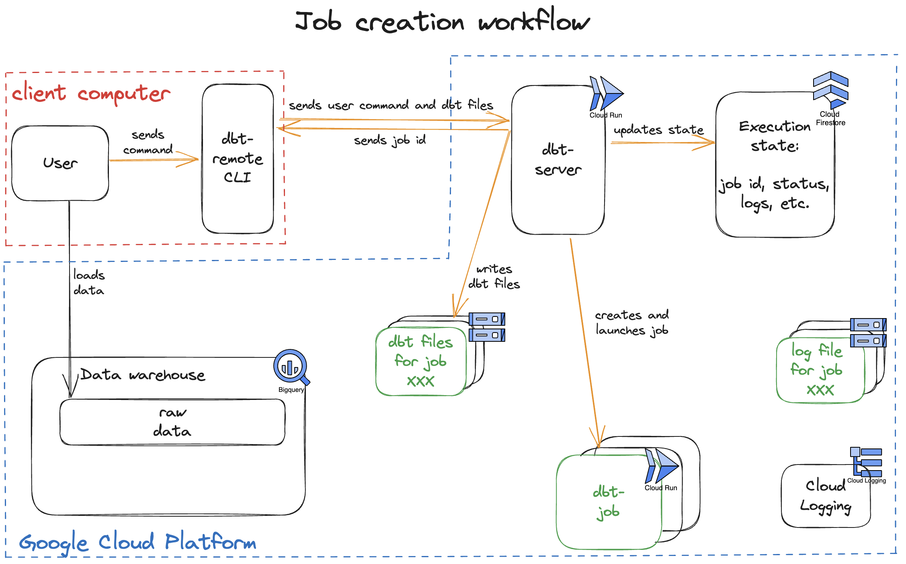
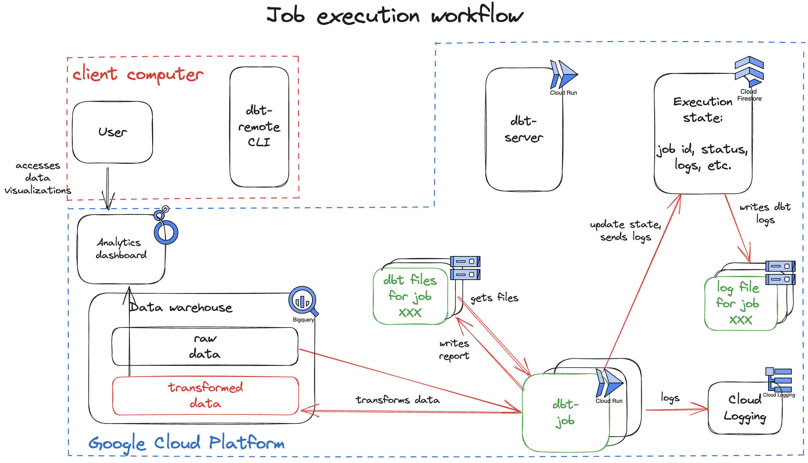
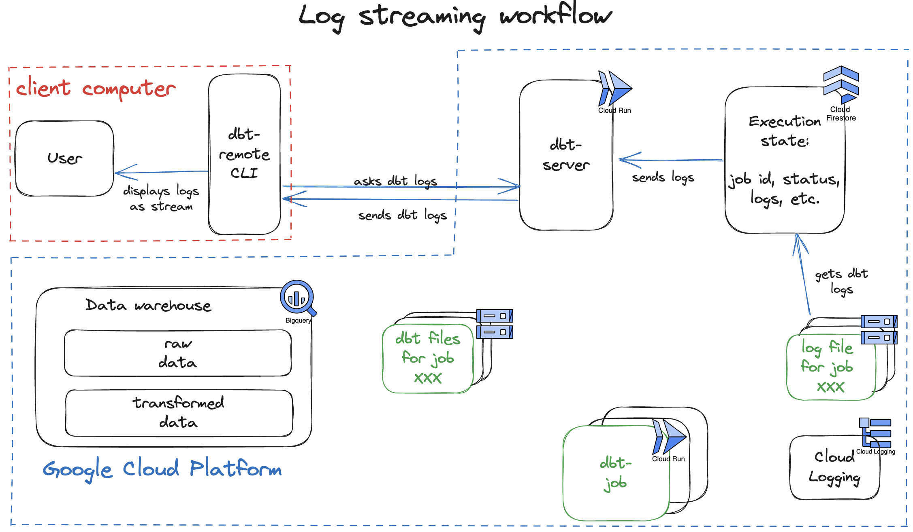

# How does it work?

The global project architecture is summed up as follow.

The main components are:

- the [dbt-remote cli](#dbt-remote-cli): it handles user command and interacts with the server (by sending the dbt command and streaming the logs). More precisely, it receives the user commands, loads the required files (manifest.json, dbt_project.yml, and possibly packages.yml and seeds files), crafts a HTTP request and sends it to the dbt-server (waiting for the server response). Once the server replies with job UUID and links to follow its execution, the cli will send requests to the server every second to follow up the job status and logs.

- the [dbt-server](#dbt-server) (Fastapi server on Cloud Run service): it handles dbt command requests by creating and launching Cloud Run jobs. It also allows the cli to stream logs by requesting the State

- the State: it is an object used by both the dbt-server and the dbt-job to store the job state. It interacts with Firestore and Google Cloud Storage and stores information such as: the uuid, the run status (running/succes/failed...), the user command, the job logs (stored on GCS).
- the dbt-job (Python script running on a Cloud Run Job): it first loads the context files (manifest.json, dbt_project.yml and others) then executes the dbt command. During the execution, it logs both on Cloud Logging and using the State. This allows the cli to follow the execution in near real-time.

These operations can be divided in 3 main flows:

- the [job creation flow](#job-creation)
- the [job execution flow](#job-execution)
- the [log streaming flow](#log-streaming)

## Job creation

When a user uses the `dbt-remote` cli to execute a dbt command:

The cli:

- detects the dbt-server. To this end, it invokes the automatic server detection (see `dbt_remote/src/dbt_remote/dbt_server_detector.py`). Using the given location, the cli sends a request to Cloud Run to list all available services, then tries to ping each service on the `/check` endpoint. If a dbt-server is running on this location, the cli should receive a message similar to `{"response":"Running dbt-server on port 8001"}`.
- fetches the required files. The dbt job will need different files to be able to run: `manifest.json` and `dbt_project.yml` are compulsory, but the cli may need to add `packages.yml` or seed files. These files are base64-encoded.
- gets a GCP `id_token`. The cli will fetch an `id_token` using `gcloud auth print-identity-token`, then add an `Authorization` header to requests.
- it sends the request to the server.

The dbt-server:

- receives the request.
- generates uuid.
- initializes a State on Firestore using the uuid. It also uses this state to load files on a Cloud Storage bucket (`manifest.json`, `dbt_project.yml`, etc.)
- processes the command. It consists in adaptating different command's parameters to the job environment. Ex: path to files like manifest, log level or format, etc. For more details, see `dbt_server/lib/command_processor.py`.
- creates and launches a Cloud Run Job
- sends a 202 response to the client, with useful links (links to follow the job's execution).

## Job execution

The job:

- loads files from the bucket.
- (if needed) installs the dependencies by running `dbt deps`.
- executes the dbt command and transforms the data (interaction with BigQuery). It uses the `dbtRunner` from `dbt-core` (see [dbtRunner code][dbt-runner])
- logs to Cloud Logging and using State. We use a custom function that ingests `dbt` output and logs it both in Cloud Logging and in Cloud Storage (thanks to the State).
- (if needed) generates Elementary report and stores it on GCS bucket.
- sends `'END JOB'` log when finished.

## Log streaming

The `dtbt-remote` cli allows the user to follow the job's logs in real-time (nearly). To this end, once the cli receives the 202 response from the dbt-server, it starts to stream the logs:

(every second) The cli:

- requests job run status
- requests job logs
- while it did not receive the log `'END JOB'` or while the run status is not `'failed'/'success'`, it starts again.

The server:

- receives the logs request
- requests the logs to the State

The State:

- receives logs requests from the server
- looks at `'log_starting_byte'` variable (which stores the last byte read from the log file, starting from 0 at the beginning of the execution).
- fetches the logs file from this byte.
- sends logs to the server.
- updates its `'log_starting_byte'` variable.

The server:

- sends the received logs to the cli.

The cli:

- displays the logs.

[//]: #

   [dbt-runner]: <https://github.com/dbt-labs/dbt-core/blob/main/core/dbt/cli/main.py>
   
