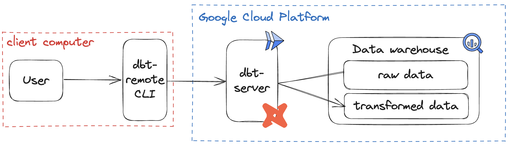

# dbt-remote project

This package aims to run [dbt][dbt-url] commands remotely on GCP using Cloud Run jobs. To this end, you need to set up a ```dbt-server``` on Cloud Run and install the ```dbt-remote``` cli to run your ```dbt``` commands.

- **Run** ```dbt-remote``` cli (for dbt users): [here](dbt_remote.md).
- **Deploy** the ```dbt-server``` (for admins): [here](dbt_server.md).
- **Learn** how it works: [here](explanation.md)

Architecture overview:




## Project guidelines

The goal of this project is to simplify the life of analytics engineers.


[//]: #

   [dbt-url]: <https://www.getdbt.com/>
